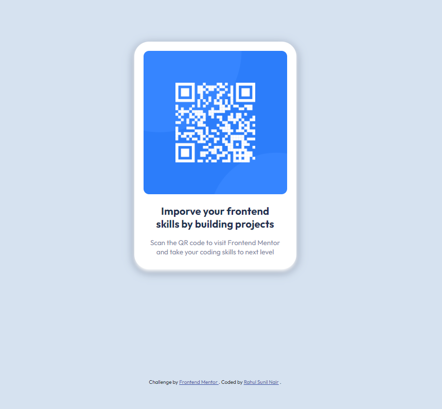

# Frontend Mentor - QR code component solution

This is a solution to the [QR code component challenge on Frontend Mentor](https://www.frontendmentor.io/challenges/qr-code-component-iux_sIO_H). Frontend Mentor challenges help you improve your coding skills by building realistic projects.

## Table of contents

- [Overview](#overview)

  - [Screenshot](#screenshot)
  - [Links](#links)

  - [Built with](#built-with)

  - [Author](#author)

## Overview

### Screenshot

### Links

- Solution URL: [Click Here](https://github.com/Rahulnair1234/Frontend-Mentor/tree/qr-code-component)
- Live Site URL: [Click Here](https://rahulnair1234.github.io/Frontend-Mentor/)

### Built with

- Semantic HTML5 markup
- CSS custom properties
- Flexbox

## Author

- Website - [Rahul Nair](https://rahul-nair-portfolio-site.web.app/)
- LinkedIn - [Rahul Nair](www.linkedin.com/in/rahul-nair-66a189228)
