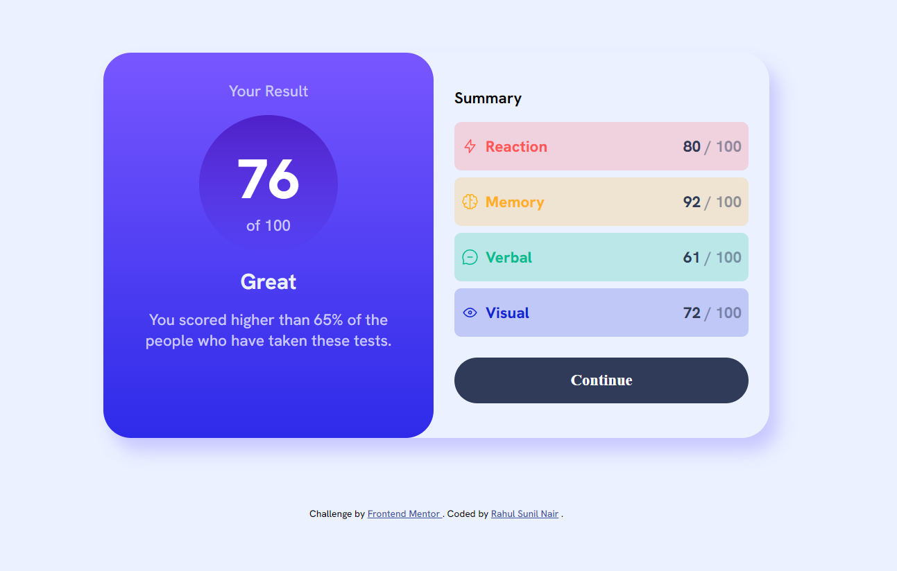
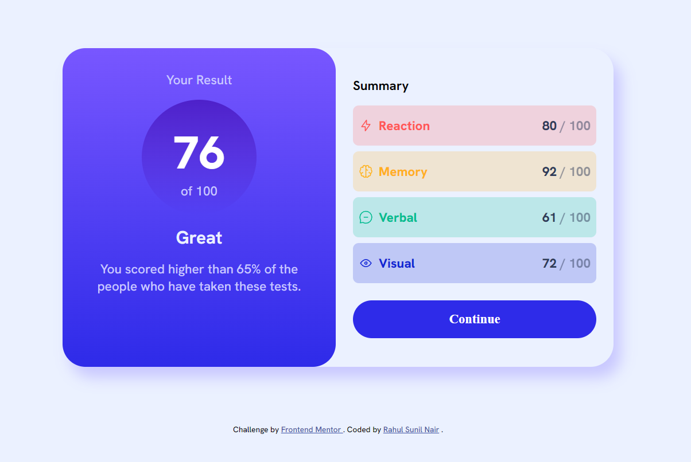
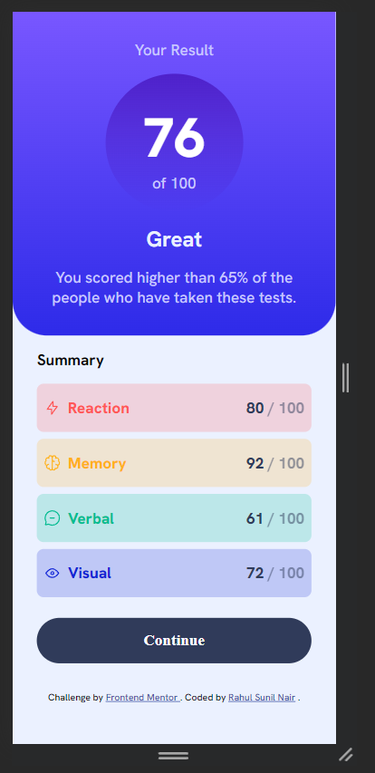

# Frontend Mentor - Results summary component solution

This is a solution to the [Results summary component challenge on Frontend Mentor](https://www.frontendmentor.io/challenges/results-summary-component-CE_K6s0maV). Frontend Mentor challenges help you improve your coding skills by building realistic projects. 

## Table of contents

- [Overview](#overview)
  - [The challenge](#the-challenge)
  - [Screenshot](#screenshot)
  - [Links](#links)
- [My process](#my-process)
  - [Built with](#built-with)
  - [What I learned](#what-i-learned)
- [Author](#author)

## Overview

### The challenge

Users should be able to:

- View the optimal layout for the interface depending on their device's screen size
- See hover and focus states for all interactive elements on the page

### Screenshot
Screenshot 1

Screenshot 2

Screenshot 3

### Links

- Solution URL: [Add solution URL here](https://github.com/Rahulnair1234/Frontend-Mentor-Sites/tree/main/results-summary-component)
- Live Site URL: [Add live site URL here](https://rahulnair1234.github.io/Frontend-Mentor-Sites/results-summary-component/)

## My process

### Built with

- Semantic HTML5 markup
- CSS custom properties
- Flexbox
- Mobile-first workflow

### What I learned

I learned about mobile first approach design

## Author

- Website - [Rahul Nair](https://rahul-nair-portfolio-site.web.app/)
- LinkedIn - [Rahul Nair](www.linkedin.com/in/rahul-nair-66a189228)
